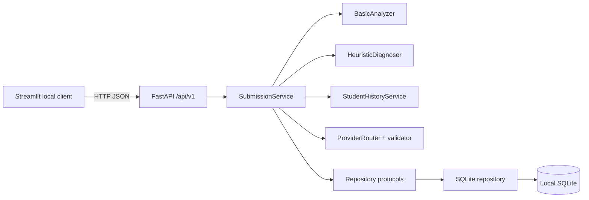

# v0.5 system architecture

`SubmissionService` coordinates repositories and replaceable analyzer, diagnosis, revision and provider services.
For an explicit revision, `RevisionService` creates or extends a Revision Group, runs local alignment and saves an
append-only Revision Snapshot before Prompt v0.5 is built. The LLM receives only screened local evidence and must
cite allowed `R...` IDs. Longitudinal analysis independently selects one representative draft per group.

## Runtime

The API route owns validation and HTTP translation only. `SubmissionService` owns the protected workflow. Its source imports neither FastAPI, Streamlit, nor sqlite3. SQLite connections, SQL, transaction rollback, and migrations are confined to the database adapter.

v0.3 adds `ComparabilityService → BaselineService → ProgressService → LearnerProfileService` behind the same API/service boundary. ProgressService reads joined structured essay/metric/diagnosis records through Repository protocols and writes append-only Snapshots. SubmissionService recalculates a local Snapshot after saving the current structured diagnosis, converts selected evidence to H IDs, and then invokes the unchanged ProviderRouter/FeedbackValidator boundary.

## Protected submission sequence

1. API Pydantic request validation.
2. `SubmissionService` saves the raw submission through Repository protocols.
3. Existing Analyzer and Diagnoser generate versioned structured inputs.
4. History service retrieves prior records through its protocol.
5. Existing Prompt Builder and Provider Router call DeepSeek or LocalDemo.
6. Existing post-validator enforces diagnosis IDs, exact quotations, history IDs, safe no-history language, and exercise links.
7. Only validated feedback and audit records are saved.

## Replacement seams

- A future frontend calls the same API; Streamlit contains no business shortcut.
- A future PostgreSQL adapter implements the same protocols; no PostgreSQL implementation is claimed today.
- Analyzer, Diagnoser, Provider and longitudinal services remain versioned replaceable components.

All services currently run on one local Windows computer. “Cloud-ready” describes boundaries and configuration, not deployment.

## v0.4 NLP boundary

`SubmissionService → AnalyzerCoordinator → AnalyzerRegistry → SpacyAnalyzer | BasicAnalyzer` keeps spaCy outside routes and UI. `SpacyAnalyzer` composes input-quality, lexical, connective and syntactic extractors plus `MetricRegistry`. The SQLite adapter appends AnalysisRun, MetricResult and JSON artifacts; the old `metrics` row remains a compatibility view. `POST /submissions/{id}/analyses` appends local analysis only and never calls a Provider.
