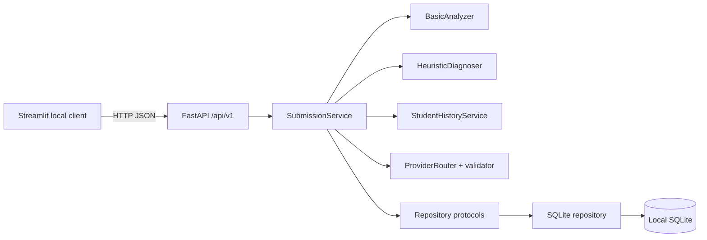

# v0.8 system architecture

`Essay → Analyzer v0.8 → versioned MetricResult + AnalysisUnitRecord → CALF Registry/Service → research API/UI`. This additive branch shares persistence and configuration infrastructure but is isolated from the existing Diagnostic Gate, prompt priorities, exercises, and student totals. Error annotations are append-only imports. Trajectories group by exact metric/unit/Analyzer compatibility and task conditions.

## v0.7.1 reliability overlay

`SubmissionService` now derives `LongitudinalAssessment` from the task-aware Snapshot before provider execution. `PromptBuilder` sends those facts under `longitudinal_facts`; `FeedbackReliabilityService` may repair only an incompatible longitudinal comment or prohibited positive-finding ability phrase, after which `FeedbackValidator` rechecks exact quotations, IDs and facts. `ProviderRouter` records a structured execution state separately from formal feedback. RevisionService also exposes a read-only trajectory composed from existing append-only snapshots. Streamlit remains API-only and caches the returned submission result in session state across tab/view rerenders.

The existing submission pipeline is preserved. After calibrated diagnosis persistence, `ProgressService` delegates task-aware calculations to `LearnerModelEngine` and saves an immutable Snapshot v2 through the same repository abstraction. The path is:

`Essay/AnalysisRun/Calibration → representative draft selection → Task Cluster → Data Sufficiency → version-separated Metric/Diagnostic Trajectory → current targets/strength patterns → History Evidence registry → screened FeedbackContext → DeepSeek/LocalDemo`.

Streamlit remains an API-only client. Migration 8 extends the existing snapshot store rather than creating a second profile system. The LLM never receives suppressed diagnostics or an unscreened history dump.

## Retained v0.6.1 architecture

## v0.6.1 diagnostic calibration flow

`SpacyAnalyzer -> MetricResult/Metric Confidence -> NlpHeuristicDiagnoser raw candidates -> DiagnosticCalibrationService -> EvidenceRelevanceValidator -> selected DiagnosisResult -> FeedbackContext -> DeepSeek or LocalDemo -> FeedbackValidator -> Repository`

The calibration layer is deterministic and provider-independent. Raw and suppressed candidates are saved in `diagnostic_calibrations`; only selected, evidence-verified priorities enter provider context and exercises. Streamlit remains an HTTP-only client. The researcher audit page calls FastAPI and never recalculates scores.

## v0.6 additions

`DashboardService` transforms Repository evidence into chart-ready, version-segmented API data. `ConfigurationService`
owns immutable non-sensitive versions and validation/activation/rollback; SQLite owns the single-active constraint and
audit history. `AdminReanalysisService` previews scope and appends AnalysisRuns, Revision Snapshots and—only after an
explicit cost confirmation—feedback records. Registries isolate Analyzer, Metric, Algorithm and Prompt discovery.

`SubmissionService` coordinates repositories and replaceable analyzer, diagnosis, revision and provider services.
For an explicit revision, `RevisionService` creates or extends a Revision Group, runs local alignment and saves an
append-only Revision Snapshot before Prompt v0.5 is built. The LLM receives only screened local evidence and must
cite allowed `R...` IDs. Longitudinal analysis independently selects one representative draft per group.

## Runtime

The API route owns validation and HTTP translation only. `SubmissionService` owns the protected workflow. Its source imports neither FastAPI, Streamlit, nor sqlite3. SQLite connections, SQL, transaction rollback, and migrations are confined to the database adapter.

v0.3 adds `ComparabilityService → BaselineService → ProgressService → LearnerProfileService` behind the same API/service boundary. ProgressService reads joined structured essay/metric/diagnosis records through Repository protocols and writes append-only Snapshots. SubmissionService recalculates a local Snapshot after saving the current structured diagnosis, converts selected evidence to H IDs, and then invokes the unchanged ProviderRouter/FeedbackValidator boundary.

## Protected submission sequence

1. API Pydantic request validation.
2. `SubmissionService` saves the raw submission through Repository protocols.
3. Existing Analyzer and Diagnoser generate versioned structured inputs.
4. History service retrieves prior records through its protocol.
5. Existing Prompt Builder and Provider Router call DeepSeek or LocalDemo.
6. Existing post-validator enforces diagnosis IDs, exact quotations, history IDs, safe no-history language, and exercise links.
7. Only validated feedback and audit records are saved.

## Replacement seams

- A future frontend calls the same API; Streamlit contains no business shortcut.
- A future PostgreSQL adapter implements the same protocols; no PostgreSQL implementation is claimed today.
- Analyzer, Diagnoser, Provider and longitudinal services remain versioned replaceable components.

All services currently run on one local Windows computer. “Cloud-ready” describes boundaries and configuration, not deployment.

## v0.4 NLP boundary

`SubmissionService → AnalyzerCoordinator → AnalyzerRegistry → SpacyAnalyzer | BasicAnalyzer` keeps spaCy outside routes and UI. `SpacyAnalyzer` composes input-quality, lexical, connective and syntactic extractors plus `MetricRegistry`. The SQLite adapter appends AnalysisRun, MetricResult and JSON artifacts; the old `metrics` row remains a compatibility view. `POST /submissions/{id}/analyses` appends local analysis only and never calls a Provider.

## v0.9.1 UI Layer

The v0.9.1 UI layer maintains the same HTTP-client-only architecture boundary as previous versions:

- `app/ui/components.py` — Reusable UI components (page headers, metric cards, status badges, etc.)
- `app/ui/pages/student_pages.py` — All 6 Student View page renderers
- `app/ui/pages/research_pages.py` — All 6 Research View page renderers
- `app/ui/streamlit_app.py` — Main orchestrator with role-based sidebar navigation
- `app/ui/api_client.py` — HTTP API client (unchanged from v0.9)
- `app/ui/locale.py` — i18n helper (unchanged from v0.8.1)

The UI layer imports only `app.config` (for API base URL) and `app.ui.*`. It does not import database, repositories, analyzers, diagnosers, or LLM providers. All data flows through the FastAPI HTTP client.

## v0.9.3-B error-handling overlay

`Request -> request-ID middleware -> readiness gate -> route -> service`
with a canonical `ApiError` model (app/errors.py) shared by the server
exception handlers and the Streamlit client classifier. Server handlers map
validation/not-found/conflict/privacy/degraded/internal failures to stable
categories with request IDs; the client distinguishes connection refusal,
timeouts, interrupted connections, lifecycle states, and HTTP errors without
relying on one generic message. Timeout profiles (connect/read/write/long-read/
lifecycle) are centralized; automatic retry is bounded, GET-only, and restricted
to retryable categories.
