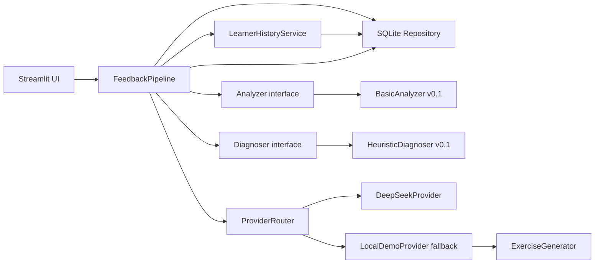

# 系统架构

## 设计原则

v0.1 采用接口与编排分离：页面不直接操作 SQLite 或调用外部 API；分析、诊断和 LLM Provider 都可独立替换。`FeedbackPipeline` 是唯一的应用闭环编排器。

## 单次提交顺序

1. Pydantic 验证输入。
2. 保存原始作文和任务信息。
3. Analyzer 返回 `metrics + analysis_version + limitations`，随后保存。
4. Diagnoser 最多选择 1 个优点和 2 个改进重点，随后保存。
5. 历史服务读取同一学生的既有记录，筛选记录条件可比的作文，并生成谨慎摘要。
6. ProviderRouter 调用主 Provider；缺 Key、网络/API/Schema 错误均自动转入 LocalDemo。
7. Pydantic 验证结构化反馈，保存 Provider、模型、状态、prompt/analysis 版本。
8. 保存与诊断类别关联的练习和本次历史摘要。

## 模块替换点

- 新分析器实现 `Analyzer.analyze()` 并返回 `AnalysisResult`。
- 新诊断器实现 `Diagnoser.diagnose()` 并返回 `DiagnosisResult`。
- 新模型服务实现 `LLMProvider.generate()` 并返回 `StructuredFeedback`。
- 新前端可直接调用 `FeedbackPipeline.submit()`，不需要理解 SQLite 或 Provider 细节。
- 数据迁移应在 Repository 层加入显式迁移版本；v0.1 当前只支持创建 Schema。

## 失败边界

外部 LLM 失败是可恢复事件，记录为 `fallback_success`。数据库或本地分析失败不会被伪装成成功，页面会显示不含秘密信息的错误类型。SQLite 不包含 API Key 字段。

