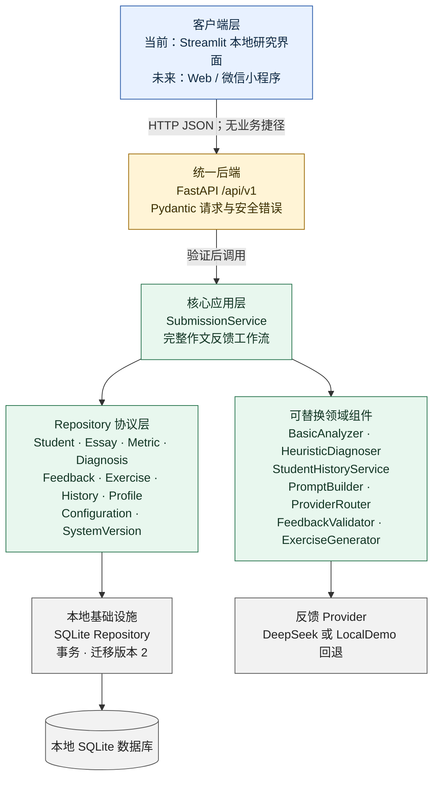
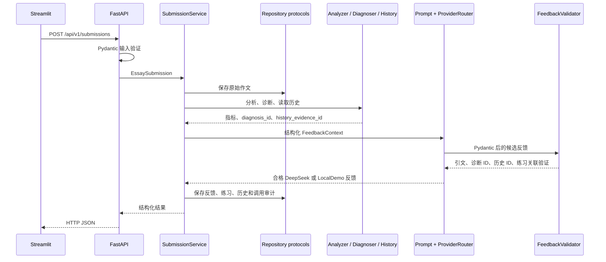

# v0.2 功能架构备份图

**结论标题：Streamlit 已成为可替换客户端，唯一受保护业务入口是本地 FastAPI。**

制图类型：软件系统结构图（C4 风格）+ 请求序列图。主要阅读路径从上到下，适合窄屏；颜色只区分客户端、统一后端、核心服务和本地基础设施，不编码质量或成熟度。

## 一次提交的证据保护序列

## 备份核对点

- Streamlit 不导入数据库、Repository、Analyzer、Diagnoser、FeedbackService 或 DeepSeekProvider。
- FastAPI route 不执行 SQL；核心服务不导入 Streamlit、FastAPI 或 sqlite3。
- DeepSeek 失败不会绕过验证，只会走同一验证器的 LocalDemo 回退。
- 版本化迁移保留旧数据；当前 `PRAGMA user_version=2`。
- PostgreSQL 只是 Repository 扩展点，尚未实现。
- 所有节点当前仍在同一台 Windows 电脑运行；图中的未来客户端不表示已开发。

纯文本回退：`Streamlit → HTTP → FastAPI → SubmissionService → Repository protocols → SQLite`；Analyzer、Diagnoser、History、Prompt、Provider 和 Validator 由 SubmissionService 编排。
