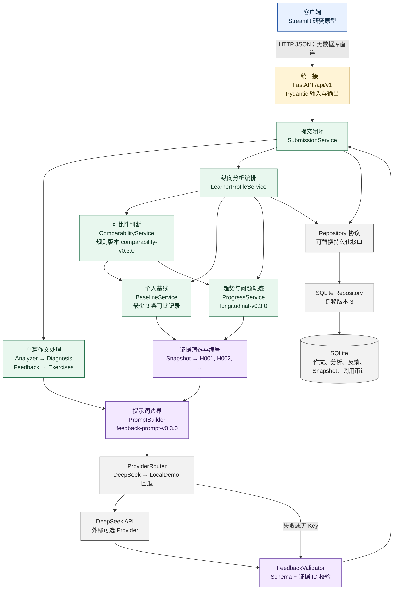
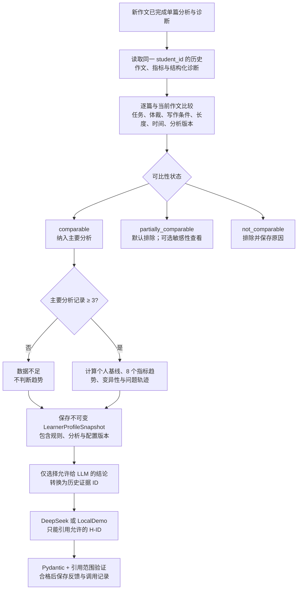
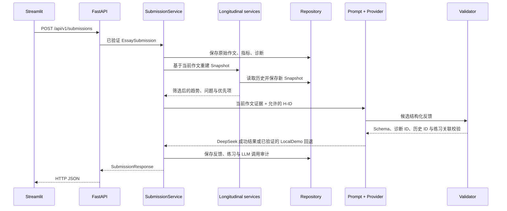

# v0.3 功能架构备份图

**结论：v0.3 在 v0.2 的 API-first 闭环上增加了可解释、可版本化的纵向分析；LLM 只能使用本地代码筛选并编号后的历史证据。**

制图类型：软件系统结构图（C4 风格）与纵向证据决策流。主阅读路径从上到下，适合窄屏。颜色仅区分客户端、接口、领域服务、数据与外部 Provider，不表示成熟度或教育效度。

## 系统与模块边界

## 纵向证据决策流

## 一次提交的关键顺序

## 备份核对点与研究边界

- 主要趋势只纳入 `comparable` 记录；`partially_comparable` 默认不影响结论，并保留排除原因。
- 少于 3 条主要记录时返回“数据不足”，不把变化解释为能力提升或下降。
- 趋势置信度最高为 `medium`；规则、阈值和版本号均可追溯，但尚未经教育实验验证。
- 问题轨迹只读取结构化诊断；“最近减少”要求至少 4 条可比记录、此前至少出现 2 次且最近 2 次未出现。
- LLM 不接收被排除作文或原始历史序列，不重新计算趋势，不得加强本地置信度。
- DeepSeek 失败时使用同一 Schema 和证据校验器验证 LocalDemo 回退；真实调用审计不保存 API Key。
- PostgreSQL、教师仪表板、CEFR、自动评分、能力增长判断和微信小程序均未在 v0.3 实现。

纯文本回退：`Streamlit → FastAPI → SubmissionService → 单篇分析 + 纵向服务 → Repository/SQLite → 筛选后的 Snapshot 证据 → PromptBuilder → DeepSeek/LocalDemo → FeedbackValidator → 保存结果`。
